## R Markdown

#### First, we load our required libraries.


```r
library(tidyverse)
```

```
## ── Attaching packages ──────────────────────────────────────────────────────────────────────────────────── tidyverse 1.3.0 ──
```

```
## ✓ ggplot2 3.2.1     ✓ purrr   0.3.3
## ✓ tibble  2.1.3     ✓ dplyr   0.8.4
## ✓ tidyr   1.0.2     ✓ stringr 1.4.0
## ✓ readr   1.3.1     ✓ forcats 0.4.0
```

```
## ── Conflicts ─────────────────────────────────────────────────────────────────────────────────────── tidyverse_conflicts() ──
## x dplyr::filter() masks stats::filter()
## x dplyr::lag()    masks stats::lag()
```

```r
library(dplyr) 
library(forcats) 
library(ggplot2) 
library(stringr) 
library(tools)
library(RColorBrewer)
library(tidycensus)
library(viridis)
```

```
## Loading required package: viridisLite
```

NOTICE: "This product uses the Census Bureau Data API but is not endorsed or certified by the Census Bureau."

If using census data, you will need to add your own API key. The README file has more information on how to go about this.


#### Loading the Data
Next, we read in the csv file "Accidental_Drug_Related_Deaths_2012-2018.csv" that came from Data.gov. The dataset contains a listing of each accidental death associated with drug overdose in Connecticut from 2012 to 2018, excluding 2015 and 2017. The dataset can be found at: https://catalog.data.gov/dataset/accidental-drug-related-deaths-january-2012-sept-2015/resource/44580a89-a260-4844-8ead-35736f395389


```r
df <- read_csv("Accidental_Drug_Related_Deaths_2012-2018.csv", col_types = cols(
  Age = col_integer(),
  Sex = col_factor(),
  Race = col_factor(),
  Location = col_factor(),
  LocationifOther = col_factor(),
  DescriptionofInjury = col_factor(),
  InjuryPlace = col_factor(),
  COD = col_factor(),
  OtherSignifican = col_factor()
  ))
```

Let's look at the first six rows of the dataset. We see that there are 41 columns -- many of which we can't see.

```r
head(df)
```

```
## # A tibble: 6 x 41
##   ID    Date  DateType   Age Sex   Race  ResidenceCity ResidenceCounty
##   <chr> <chr> <chr>    <int> <fct> <fct> <chr>         <chr>          
## 1 14-0… 06/2… DateRep…    NA <NA>  <NA>  <NA>          <NA>           
## 2 13-0… 03/2… DateofD…    48 Male  Black NORWALK       <NA>           
## 3 16-0… 03/1… DateofD…    30 Fema… White SANDY HOOK    FAIRFIELD      
## 4 16-0… 03/3… DateofD…    23 Male  White RYE           WESTCHESTER    
## 5 13-0… 02/1… DateofD…    22 Male  Asia… FLUSHING      QUEENS         
## 6 14-0… 06/2… DateofD…    23 Male  White BRISTOL       <NA>           
## # … with 33 more variables: ResidenceState <chr>, DeathCity <chr>,
## #   DeathCounty <chr>, Location <fct>, LocationifOther <fct>,
## #   DescriptionofInjury <fct>, InjuryPlace <fct>, InjuryCity <chr>,
## #   InjuryCounty <chr>, InjuryState <chr>, COD <fct>, OtherSignifican <fct>,
## #   Heroin <chr>, Cocaine <chr>, Fentanyl <chr>, FentanylAnalogue <chr>,
## #   Oxycodone <chr>, Oxymorphone <chr>, Ethanol <chr>, Hydrocodone <chr>,
## #   Benzodiazepine <chr>, Methadone <chr>, Amphet <chr>, Tramad <chr>,
## #   Morphine_NotHeroin <chr>, Hydromorphone <chr>, Other <chr>,
## #   OpiateNOS <chr>, AnyOpioid <chr>, MannerofDeath <chr>, DeathCityGeo <chr>,
## #   ResidenceCityGeo <chr>, InjuryCityGeo <chr>
```

We should check that the ID's are unique.

```r
test_unique <- df%>%
  group_by(ID)%>%
  summarize(count = n_distinct(ID))
  nrow(df) == nrow(test_unique)
```

```
## [1] TRUE
```
#### Cleaning the data

Now we should spread the variables "DateReported" and "DateofDeath" from the DateType column into separate columns. We also know see that there are 5,105 rows in this dataset.

```r
df2 <- df %>% 
  spread(key = DateType, value = Date) %>% 
  select(-`<NA>`) #remove the new NA column
df2 <- df2[c(1,40,41, 2:39)] #reorder columns so that the variables DateofDeath and DateReported come after ID
df2%>%
  select(ID, DateofDeath, DateReported)
```

```
## # A tibble: 5,105 x 3
##    ID      DateofDeath            DateReported          
##    <chr>   <chr>                  <chr>                 
##  1 14-0273 <NA>                   06/28/2014 12:00:00 AM
##  2 13-0102 03/21/2013 12:00:00 AM <NA>                  
##  3 16-0165 03/13/2016 12:00:00 AM <NA>                  
##  4 16-0208 03/31/2016 12:00:00 AM <NA>                  
##  5 13-0052 02/13/2013 12:00:00 AM <NA>                  
##  6 14-0277 06/29/2014 12:00:00 AM <NA>                  
##  7 12-0205 08/12/2012 12:00:00 AM <NA>                  
##  8 13-0404 11/10/2013 12:00:00 AM <NA>                  
##  9 12-0107 04/25/2012 12:00:00 AM <NA>                  
## 10 13-0161 05/15/2013 12:00:00 AM <NA>                  
## # … with 5,095 more rows
```


Let's separate the day, month, year, and times from DateofDeath and DateReported. 

```r
df3 <- df2%>%
  separate(DateofDeath, into = c("DateofDeath", "TimeofDeath"), sep = 11)%>%
  separate(DateofDeath, into = c("DeathMonth", "DeathDay", "DeathYear"), sep = "/", convert = TRUE)%>%
  separate(DateReported, into = c("DateReported", "TimeofReport"), sep = 11)%>%
  separate(DateReported, into = c("ReportMonth", "ReportDay", "ReportYear"), sep = "/", convert = TRUE)
df3%>%
  select(ID, DeathMonth, DeathDay, DeathYear, TimeofDeath, ReportMonth, ReportDay, ReportYear, TimeofReport)
```

```
## # A tibble: 5,105 x 9
##    ID    DeathMonth DeathDay DeathYear TimeofDeath ReportMonth ReportDay
##    <chr>      <int>    <int>     <dbl> <chr>             <int>     <int>
##  1 14-0…         NA       NA        NA <NA>                  6        28
##  2 13-0…          3       21      2013 12:00:00 AM          NA        NA
##  3 16-0…          3       13      2016 12:00:00 AM          NA        NA
##  4 16-0…          3       31      2016 12:00:00 AM          NA        NA
##  5 13-0…          2       13      2013 12:00:00 AM          NA        NA
##  6 14-0…          6       29      2014 12:00:00 AM          NA        NA
##  7 12-0…          8       12      2012 12:00:00 AM          NA        NA
##  8 13-0…         11       10      2013 12:00:00 AM          NA        NA
##  9 12-0…          4       25      2012 12:00:00 AM          NA        NA
## 10 13-0…          5       15      2013 12:00:00 AM          NA        NA
## # … with 5,095 more rows, and 2 more variables: ReportYear <dbl>,
## #   TimeofReport <chr>
```

Now let's check if the TimeOfDeath or TimeofReport every change.

```r
df3 %>%
  group_by(TimeofDeath)%>%
  summarise(n = n())
```

```
## # A tibble: 2 x 2
##   TimeofDeath     n
##   <chr>       <int>
## 1 12:00:00 AM  2822
## 2 <NA>         2283
```

```r
df3 %>%
  group_by(TimeofReport)%>%
  summarise(n = n())
```

```
## # A tibble: 2 x 2
##   TimeofReport     n
##   <chr>        <int>
## 1 12:00:00 AM   2281
## 2 <NA>          2824
```

Since *TimeofDeath* and *TimeofReport* are always marked as "12:00:00 AM" or "NA", let's remove them from the dataset.

We also want to know if InjuryState has useful information.

```r
df3%>%
  group_by(InjuryState)%>%
  summarise(n = n())
```

```
## # A tibble: 4 x 2
##   InjuryState     n
##   <chr>       <int>
## 1 CONNECTICUT     1
## 2 CT           1419
## 3 NY              4
## 4 <NA>         3681
```

We should remove InjuryState as the information is mostly missing. Let's also remove *MannerofDeath*, *DeathCityGeo*, and *ResidenceCityGeo*, and *InjuryCityGeo* because they won't be used in this portion of the analysis. I would also like to remove the columns *Other*, *OpiateNOS*, and *AnyOpiod* as there are already 20 other columns with details on the drugs taken.

```r
df3 <- df3%>%
  select(-TimeofDeath, -TimeofReport, -InjuryState, -MannerofDeath , -DeathCityGeo, -ResidenceCityGeo, -InjuryCityGeo, -Other, -OpiateNOS, -AnyOpioid)
```

Now we need to fix the capitalization of several columns. Let's create a function for this.

```r
capitalizeColumns <- function(df,vars){
     require(tools)
     for(v in vars) 
       df[[v]] <- toTitleCase(tolower(df[[v]]))
     df
}
```


Let's apply the *captilalizeColumns* function to the columns that are all in uppercase.

```r
df3 <- df3%>%
  capitalizeColumns(c("ResidenceCity", "ResidenceCounty", "DeathCity", "DeathCounty", "InjuryCity", "InjuryCounty", "LocationifOther", "DescriptionofInjury", "InjuryPlace", "COD", "OtherSignifican"))
df3%>%
  select(ResidenceCity, ResidenceCounty, ResidenceState, DeathCity, DeathCounty, InjuryCity, InjuryCounty, LocationifOther, DescriptionofInjury, InjuryPlace, COD, OtherSignifican)
```

```
## # A tibble: 5,105 x 12
##    ResidenceCity ResidenceCounty ResidenceState DeathCity DeathCounty InjuryCity
##    <chr>         <chr>           <chr>          <chr>     <chr>       <chr>     
##  1 <NA>          <NA>            <NA>           <NA>      <NA>        <NA>      
##  2 Norwalk       <NA>            <NA>           Norwalk   Fairfield   <NA>      
##  3 Sandy Hook    Fairfield       CT             Danbury   <NA>        Unknown   
##  4 Rye           Westchester     NY             Greenwich <NA>        Rye       
##  5 Flushing      Queens          <NA>           Greenwich Fairfield   <NA>      
##  6 Bristol       <NA>            <NA>           Bristol   Hartford    <NA>      
##  7 West Hartford Hartford        <NA>           West Har… Hartford    <NA>      
##  8 Hamden        New Haven       <NA>           New Haven New Haven   <NA>      
##  9 East Hartford Hartford        <NA>           East Har… Hartford    <NA>      
## 10 Montville     New London      <NA>           Montville New London  <NA>      
## # … with 5,095 more rows, and 6 more variables: InjuryCounty <chr>,
## #   LocationifOther <chr>, DescriptionofInjury <chr>, InjuryPlace <chr>,
## #   COD <chr>, OtherSignifican <chr>
```

Now let's combine columns related to the drug taken. 

First, we need to replace each column variable that has a "Y" with the name of the column.

```r
for (i in 1:length(df3)) {
    df3[[i]] <- str_replace(df3[[i]], "Y", colnames(df3)[i])
}
df3%>%
  select(24:31) #show changed columns
```

```
## # A tibble: 5,105 x 8
##    Heroin Cocaine Fentanyl FentanylAnalogue Oxycodone Oxymorphone Ethanol
##    <chr>  <chr>   <chr>    <chr>            <chr>     <chr>       <chr>  
##  1 <NA>   <NA>    Fentanyl <NA>             <NA>      <NA>        <NA>   
##  2 <NA>   Cocaine <NA>     <NA>             <NA>      <NA>        <NA>   
##  3 Heroin Cocaine <NA>     <NA>             <NA>      <NA>        <NA>   
##  4 Heroin <NA>    Fentanyl <NA>             <NA>      <NA>        <NA>   
##  5 <NA>   <NA>    Fentanyl <NA>             <NA>      <NA>        <NA>   
##  6 Heroin <NA>    <NA>     <NA>             <NA>      <NA>        <NA>   
##  7 Heroin <NA>    <NA>     <NA>             <NA>      <NA>        <NA>   
##  8 <NA>   Cocaine <NA>     <NA>             <NA>      <NA>        <NA>   
##  9 Heroin <NA>    <NA>     <NA>             <NA>      <NA>        <NA>   
## 10 <NA>   <NA>    <NA>     <NA>             Oxycodone <NA>        <NA>   
## # … with 5,095 more rows, and 1 more variable: Hydrocodone <chr>
```

Next, we combine the drugs into one column.

```r
df3 <- df3%>%
  unite(col = Drug, Heroin, Cocaine, Fentanyl, FentanylAnalogue, Oxycodone, Oxymorphone, Ethanol, Hydrocodone, Benzodiazepine, Methadone, Amphet, Tramad, Morphine_NotHeroin, Hydromorphone, sep =" & ",na.rm = TRUE)
df3%>%
  select(Drug)
```

```
## # A tibble: 5,105 x 1
##    Drug                                   
##    <chr>                                  
##  1 Fentanyl & Hydrocodone & Benzodiazepine
##  2 Cocaine                                
##  3 Heroin & Cocaine                       
##  4 Heroin & Fentanyl                      
##  5 Fentanyl                               
##  6 Heroin                                 
##  7 Heroin                                 
##  8 Cocaine                                
##  9 Heroin                                 
## 10 Oxycodone                              
## # … with 5,095 more rows
```

When the variables in drug columns were converted to the name of the columns the "NY" variables in the column *ResidenceState* were converted to "NResidenceState". We need to change these back to "NY".

```r
df3 <- df3%>%
  mutate(ResidenceState = fct_recode(ResidenceState,
                                     "NY" = "NResidenceState"))
```

We should look at the levels of Race.

```r
df3%>%
  select(Race)%>%
  group_by(Race)%>%
  summarize(n = n())
```

```
## # A tibble: 12 x 2
##    Race                       n
##    <chr>                  <int>
##  1 Asian Indian              14
##  2 Asian, Other              18
##  3 Black                    433
##  4 Chinese                    2
##  5 Hawaiian                   1
##  6 Hispanic, Black           24
##  7 Hispanic, White          561
##  8 Native American, Other     1
##  9 Other                     11
## 10 Unknown                   23
## 11 White                   4004
## 12 <NA>                      13
```

We should recode the levels of "Race" to help with visualizations. For the purpose of this analysis we will combine "Asian, Other", "Asian, Indian", and "Chinese". We will also combine Hawaiian and Native American with the "Other" category for the analysis as there is one Hawaiian and one Native American. For this analysis the visualizations will be clearer with fewer categories.


```r
df3 <- df3%>%
  mutate(Race = fct_recode(Race,
                                     "Asian" = "Asian, Other",
                                     "Asian" = "Asian Indian",
                                     "Asian" = "Chinese",
                                     "Other" = "Other",
                                     "Other" = "Unknown",
                                    "Other" = "Hawaiian",
                                    "Other" = "Native American, Other"
                                     ))
```

Before visualizing the data let's make sure datatypes are corrected for variables we want to visualize. 

```r
df3$DeathMonth<- factor(df3$DeathMonth, levels=c(1,2,3,4,5,6,7,8,9,10,11,12))
df3$DeathYear<- factor(df3$DeathYear, levels=c(2012,2013,2014,2016,2018))
df3$Sex<- factor(df3$Sex, levels=c("Male", "Female"))
df3 <- df3%>%
  mutate(Age = as.integer(Age))%>%
  mutate(Drug = as.factor(Drug))
df3
```

```
## # A tibble: 5,105 x 24
##    ID    DeathMonth DeathDay DeathYear ReportMonth ReportDay ReportYear   Age
##    <chr> <fct>      <chr>    <fct>     <chr>       <chr>     <chr>      <int>
##  1 14-0… <NA>       <NA>     <NA>      6           28        2014          NA
##  2 13-0… 3          21       2013      <NA>        <NA>      <NA>          48
##  3 16-0… 3          13       2016      <NA>        <NA>      <NA>          30
##  4 16-0… 3          31       2016      <NA>        <NA>      <NA>          23
##  5 13-0… 2          13       2013      <NA>        <NA>      <NA>          22
##  6 14-0… 6          29       2014      <NA>        <NA>      <NA>          23
##  7 12-0… 8          12       2012      <NA>        <NA>      <NA>          21
##  8 13-0… 11         10       2013      <NA>        <NA>      <NA>          40
##  9 12-0… 4          25       2012      <NA>        <NA>      <NA>          40
## 10 13-0… 5          15       2013      <NA>        <NA>      <NA>          50
## # … with 5,095 more rows, and 16 more variables: Sex <fct>, Race <fct>,
## #   ResidenceCity <chr>, ResidenceCounty <chr>, ResidenceState <fct>,
## #   DeathCity <chr>, DeathCounty <chr>, Location <chr>, LocationifOther <chr>,
## #   DescriptionofInjury <chr>, InjuryPlace <chr>, InjuryCity <chr>,
## #   InjuryCounty <chr>, COD <chr>, OtherSignifican <chr>, Drug <fct>
```
#### Descriptive Graphics

Now we want to look at the discribution of age and sex in this dataset. Most deaths appear to take place between 20 and 60 years old. The histogram also shows a sharp increase in deaths every 5 years. Females account for less accidental drug related deaths than men but follow a similar pattern to men.


```r
df3%>%
  filter(!is.na(Age) & !is.na(Sex) & !Sex == "Unknown") %>%
  ggplot() +
  geom_histogram(aes(x = Age, fill = Sex), color = "white")+
  scale_fill_brewer(palette = "Paired")+
  scale_x_continuous(breaks = c(15,20,25,30,35,40,45,50,55,60,65,70,75,80))+
  labs(title = 'Amount of Deaths by Age',
       y = 'Death Count'
       )
```

```
## `stat_bin()` using `bins = 30`. Pick better value with `binwidth`.
```

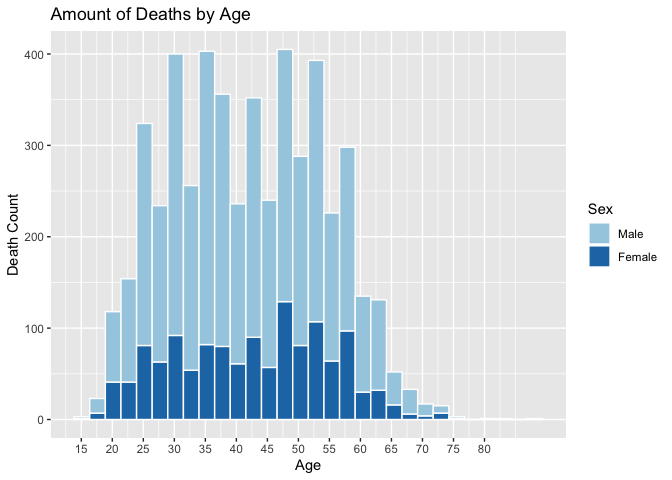<!-- -->

Now let's look at the fifteen most common drugs causing accidental drug deaths. 

```r
df4 <- df3%>%
  select(Drug, Age)%>%
  group_by(Drug)%>%
  summarize(
    n = n())%>%
  arrange(desc(n))%>%
  na_if("")%>%
  na.omit(Drug)%>%
  slice(1:15)
df4
```

```
## # A tibble: 15 x 2
##    Drug                                   n
##    <fct>                              <int>
##  1 Heroin                               577
##  2 Fentanyl                             325
##  3 Heroin & Fentanyl                    274
##  4 Cocaine                              240
##  5 Heroin & Cocaine                     239
##  6 Heroin & Ethanol                     167
##  7 Cocaine & Fentanyl                   159
##  8 Heroin & Cocaine & Fentanyl          141
##  9 Heroin & Benzodiazepine              118
## 10 Fentanyl & Ethanol                   117
## 11 Heroin & Fentanyl & Ethanol          108
## 12 Fentanyl & Benzodiazepine             94
## 13 Heroin & Fentanyl & Benzodiazepine    92
## 14 Oxycodone                             89
## 15 Benzodiazepine & Methadone            79
```

Here's a visualize of the top drugs. Heroin, fentanyl, and cocaine and various combinations of them, caused the most deaths between 2012 and 2018.

```r
df4%>%
ggplot(aes(x  = reorder(Drug, n), y = n))+
  geom_bar(stat = "identity", fill = "Red", alpha = 0.5)+
  coord_flip()+
  labs(title = 'Fifteen Most Frequent Drug Combinations Causing Death',
       x = 'Drugs',
       y = 'Death Count'
       )
```

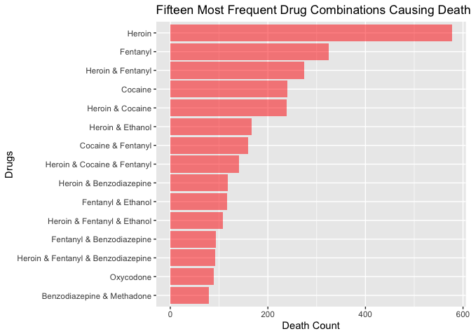<!-- -->

We're going to make a new dataframe with only the 5 most common drug combinations, so that we can conduct further exploratory data analysis.

```r
df4 <- df4%>%
  slice(1:5)
df5 <- df3%>%
  filter(Drug %in% df4$Drug)
df5
```

```
## # A tibble: 1,655 x 24
##    ID    DeathMonth DeathDay DeathYear ReportMonth ReportDay ReportYear   Age
##    <chr> <fct>      <chr>    <fct>     <chr>       <chr>     <chr>      <int>
##  1 13-0… 3          21       2013      <NA>        <NA>      <NA>          48
##  2 16-0… 3          13       2016      <NA>        <NA>      <NA>          30
##  3 16-0… 3          31       2016      <NA>        <NA>      <NA>          23
##  4 13-0… 2          13       2013      <NA>        <NA>      <NA>          22
##  5 14-0… 6          29       2014      <NA>        <NA>      <NA>          23
##  6 12-0… 8          12       2012      <NA>        <NA>      <NA>          21
##  7 13-0… 11         10       2013      <NA>        <NA>      <NA>          40
##  8 12-0… 4          25       2012      <NA>        <NA>      <NA>          40
##  9 12-0… 8          23       2012      <NA>        <NA>      <NA>          26
## 10 15-0… <NA>       <NA>     <NA>      <NA>        <NA>      <NA>          NA
## # … with 1,645 more rows, and 16 more variables: Sex <fct>, Race <fct>,
## #   ResidenceCity <chr>, ResidenceCounty <chr>, ResidenceState <fct>,
## #   DeathCity <chr>, DeathCounty <chr>, Location <chr>, LocationifOther <chr>,
## #   DescriptionofInjury <chr>, InjuryPlace <chr>, InjuryCity <chr>,
## #   InjuryCounty <chr>, COD <chr>, OtherSignifican <chr>, Drug <fct>
```

Using this new dataframe, we can look at age according to the top five drugs. Looking at the boxplot below, people seem to die from cocaine at an older age than those who die from other drugs. They die in their mid 40s to mid 50s, whereas people who die from other drugs, die in their late 20s to late 40s. These deaths range from the 25 percentile to 75th percentile. Therefore, deaths take place outside of this range. There are also a few outliers that we can also note for "cocaine" and "heroin & fentanyl".  

```r
df5%>%
  ggplot(mapping = aes(x = Drug, y = Age, fill = Drug)) + 
  geom_boxplot() +
  scale_fill_viridis(option = "D", discrete = TRUE)+
  theme(legend.position = "none")+
  labs(
    title = "Boxplot of Drug Type vs Age"
  )
```

```
## Warning: Removed 2 rows containing non-finite values (stat_boxplot).
```

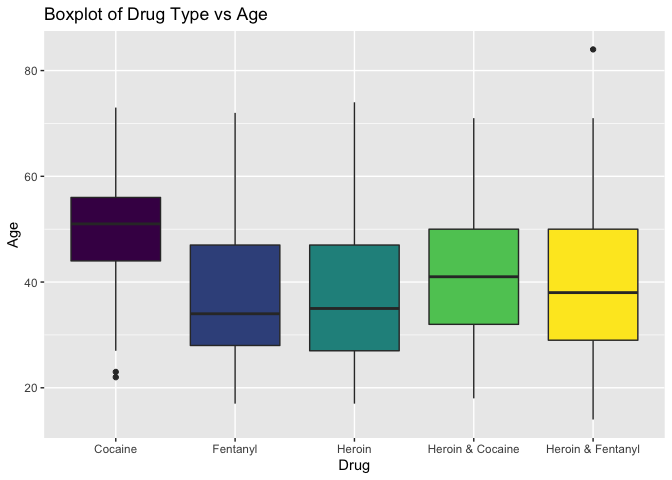<!-- -->


A violin plot of this data could help visualize the distribution of data. The graph shows that deaths from cocaine do concentrate at 50 years old with outliers leading down to 20 years old. Heroin and fentanyl concentrate around 30 years old and have outliers at older ages. "Heroin & Cocaine" has a fairly even distribution. "Heroin & Fentanyl" is slightly bimodal with concentrations at 30 years old and 50 years old, which is interesting. There are outliers as well leading up past 80 years old.

```r
df5%>%
  ggplot(mapping = aes(x = Drug, y = Age, fill = Drug)) + 
  geom_violin() +
  theme(legend.position = "none")+
  scale_fill_viridis(option = "D", discrete = TRUE)+
  labs(
    title = "Violin Plot of Drug Type vs Age"
  )
```

```
## Warning: Removed 2 rows containing non-finite values (stat_ydensity).
```

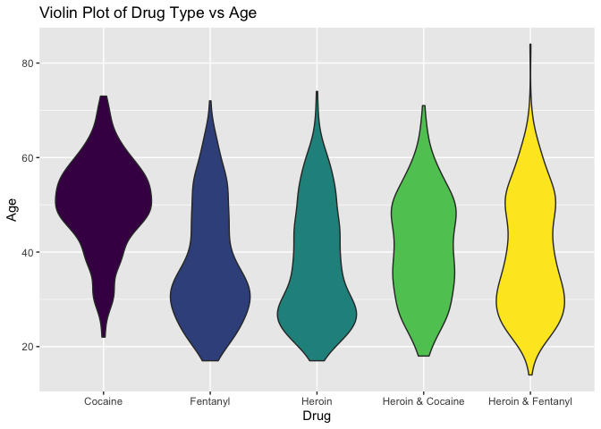<!-- -->


The boxplot below compares race and age. It shows that asian people have died from accidental drug related deaths before the age of 40, except for two outliers. Unlike asian people, the middle 50th percentile of black people have died between 40 and 60 years old with the median at 50 years old. The middle 50th percentile of white people have died between 30 and 50 years old.

```r
df5%>%
  filter(!is.na(Race))%>%
  ggplot(mapping = aes(x = Race, y = Age, fill = Race)) + 
  geom_boxplot()+
  scale_fill_viridis(option = "B", discrete = TRUE)+
  theme(legend.position = "none")+
  labs(
    title = "Boxplot of Drug Type vs Race"
  )
```

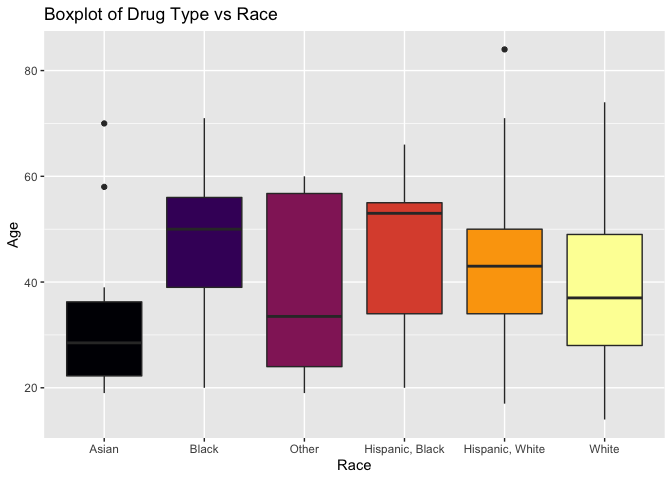<!-- -->

The violin plot below helps examine the distrubution of age and race. It shows where each group's outliers are, and it shows that the white distribution is slightly bimodal. 

```r
df5%>%
  filter(!is.na(Race))%>%
  ggplot(mapping = aes(x = Race, y = Age, fill = Race)) + 
  geom_violin() +
  scale_fill_viridis(option = "B", discrete = TRUE)+
  theme(legend.position = "none")+
  labs(
    title = "Violin Plot of Drug Type vs Race"
  )
```

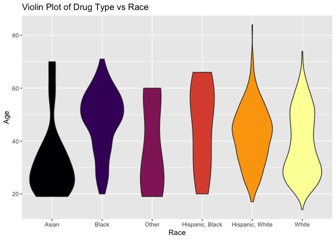<!-- -->

The graph below compares race and the top 5 drugs. Looking at the graph, it appears that white people have the largest amount of deaths for all five drugs. It also shows that heroin, by itself, accounts for the most deaths. We can also see that a large proportion of black people died from cocaine and a large proportion of white people died from heroin. 

```r
df5%>%
  filter(!is.na(Race) & (Drug == "Heroin" | Drug == "Fentanyl" | Drug == "Heroin & Fentanyl" | Drug == "Cocaine" | Drug == "Heroin & Cocaine"))%>%
  ggplot(aes(Drug, fill = Race)) +
  geom_bar()+
  scale_fill_brewer(palette = "Paired")+
  theme(axis.text.x = element_text(angle = -60))+
  labs(title = 'Top 5 Drugs vs Death Count Broken Down by Race',
       y = 'Death Count'
       )
```

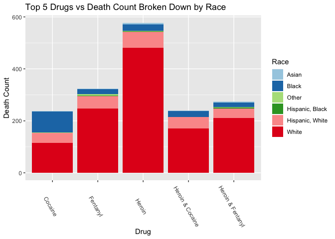<!-- -->

This next graph looks at the amount of deaths per year for the 5 most common drugs causing death. It shows that 2016 saw the most deaths and 2018 saw a steep decline in deaths. Deaths related to fentanyl or the combination of fentanyl and heroin have increased over the years. In particular, there was a big jump in deaths caused by fentanyl from 2012 to 2016. Deaths caused by cocaine or heroin, or the combination of the two, seem to have decreased over the years. 

```r
df5%>%
  filter(!is.na(DeathYear))%>%
  ggplot(aes(x = DeathYear, fill = Drug)) +
  geom_bar()+
  scale_fill_brewer(palette = "Paired")+
  labs(title = 'Top 5 Drugs Causing Death Per Year',
       x = 'Death Year',
       y = 'Death Count'
       )
```

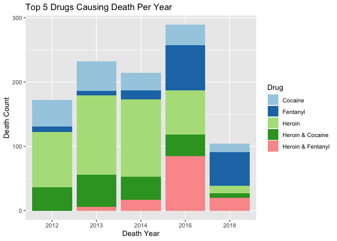<!-- -->


Now, looking at the amount of deaths per month for the top five drugs, it appears the fewest deaths occur in January and the most deaths occur in November. In general, deaths appear to peak every 3 months, with an overall increase throughout the year.

```r
df5%>%
  filter(!is.na(DeathMonth))%>%
  ggplot(aes(x = DeathMonth, fill = Drug)) +
  scale_fill_brewer(palette = "Paired")+
  geom_bar()+
  labs(title = 'Top 5 Drugs Causing Death Per Month',
       y = 'Death Count',
       x = 'Death Month'
       )
```

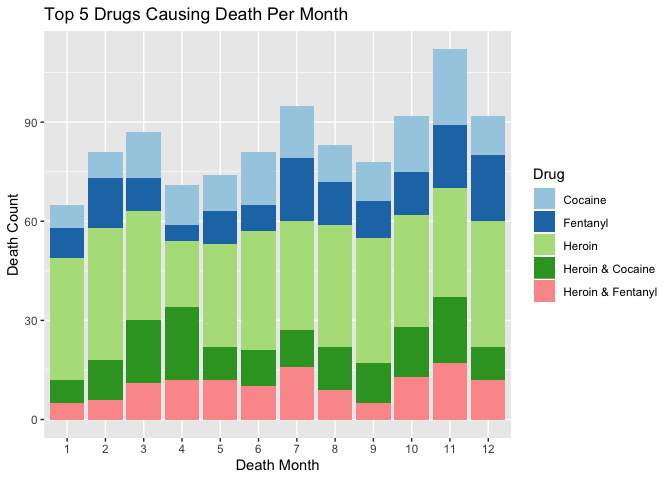<!-- -->


Next, we want to see the distribution of deaths by age for the 6 most common drugs. We show the breakdown of the year each death occured. Looking at the graph, it appears that deaths related to cocaine occur more often in someone's 40s and 50s. Deaths related to heroin peak in someone's 20s, especially during their mid-20s. They also peak during the mid-40s. Deaths related to fentanyl seem to concentrate in someone's 20s and 30s. Another interesting feature to notice is that deaths related to cocaine and heroin occured primarily between 2012-2014, while deaths related to fentanyl began later, in 2016. 


```r
df3%>%
  filter(!is.na(Age) & !is.na(DeathYear) & (Drug == "Heroin" | Drug == "Fentanyl" | Drug == "Heroin & Fentanyl" | Drug == "Cocaine" | Drug == "Heroin & Cocaine" | Drug == "Heroin & Ethanol")) %>%
  ggplot() +
  geom_bar(aes(x = Age, fill = DeathYear), width = 0.9)+
  scale_fill_viridis(option = "D", discrete = TRUE)+
  labs(title = 'Top 5 Drugs vs Death Count Per Year',
       y = 'Death Count',
       x = 'Drug'
       )+
  facet_wrap(~ Drug, nrow = 3)
```

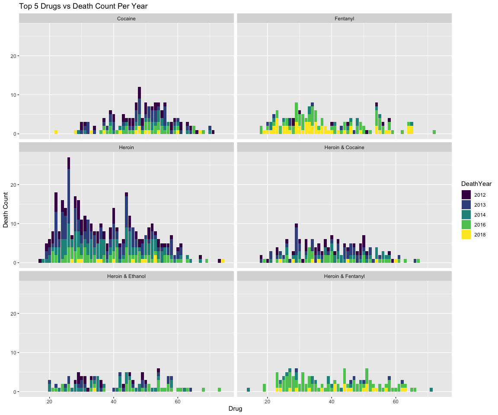<!-- -->


#### Further Data Cleaning
There are several columns of this dataset with hundreds of different values. For instance, here is the *LocationifOther* variable. We can see that there are 293 unique values. Looking through them, many indicate a person was at a hotel, motel, or lodge. Another common trend is that a person was at another person's residence. Finally, many people were found in a vehicle, car, or cab.

```r
df3%>%
  select(LocationifOther)%>%
  group_by(LocationifOther)%>%
  summarize(n = n())
```

```
## # A tibble: 293 x 2
##    LocationifOther                  n
##    <chr>                        <int>
##  1 "\"Sober House\""                1
##  2 "Abandon House"                  1
##  3 "Abandoned Building"             4
##  4 "Abandoned Garage"               2
##  5 "Abandoned House"                1
##  6 "Almar Motel"                    1
##  7 "America's Best Hotel"           1
##  8 "America's Best Value Hotel"     1
##  9 "American Inn Hotel"             1
## 10 "American Motor Lodge"           2
## # … with 283 more rows
```

We want to extract certain keywords from the current 293 variables and then combine them to create higher-level variables.  First, we will create a vector with commonly found words within the column called *locations*. Then we will collapse these values int othe variable *location_match* separated by "|'s". This will serve as the pattern to look for within the str_extract_all function.

```r
locations <- c("Lodge", "Hotel", "Motel", "Inn", "Super 8", "Vehicle", "Cab", "Car", "Boyfriend", "Girlfriend", "Sister", "Brother", "Cousin", "Dad", "Father", "Friend", "Grandfather", "Grandmother", "Godfather", "Companion", "Neighbor", "Mother", "Niece", "Parent")
location_match <- str_c(locations, collapse = "|")
location_match
```

```
## [1] "Lodge|Hotel|Motel|Inn|Super 8|Vehicle|Cab|Car|Boyfriend|Girlfriend|Sister|Brother|Cousin|Dad|Father|Friend|Grandfather|Grandmother|Godfather|Companion|Neighbor|Mother|Niece|Parent"
```

Here we extract the keywords using the function *str_extract_all*. We then summarize the variables within the column to show the new variables.

```r
df8 <- df3%>%
  mutate(LocationifOther = str_extract_all(LocationifOther, location_match))%>%
  unnest() 
```

```
## Warning: `cols` is now required.
## Please use `cols = c(LocationifOther)`
```

```r
df8%>%
  select(LocationifOther)%>%
  group_by(LocationifOther)%>%
  summarize(n = n())
```

```
## # A tibble: 25 x 2
##    LocationifOther     n
##    <chr>           <int>
##  1 Boyfriend          12
##  2 Brother             8
##  3 Cab                 1
##  4 Car                10
##  5 Companion           1
##  6 Cousin              3
##  7 Dad                 1
##  8 Father              7
##  9 Friend            146
## 10 Girlfriend         15
## # … with 15 more rows
```

Here we use the function *fct_collapse* to combine the variables into the higher-level variables: Hotels_Motels, Other_Residences, and Vehicle. 

```r
df8<-df8%>%
  mutate(LocationifOther = fct_collapse(LocationifOther,
                                        Hotels_Motels = c("Hotel", "Motel", "Inn", "Lodge", "Super 8"),
                                        Others_Residence = c("Boyfriend", "Brother", "Companion", "Cousin", "Dad", "Father", "Friend", "Girlfriend", "Godfather", "Grandmother", "Grandfather", "Mother", "Niece", "Parent", "Sister", "Neighbor"),
                                        Vehicle = c("Vehicle", "Cab", "Car")
  ))
df8$LocationifOther<- factor(df8$LocationifOther, levels=c("Hotels_Motels","Others_Residence", "Vehicle"))
df8%>%
  select(LocationifOther)%>%
  group_by(LocationifOther)%>%
  summarize(n = n())
```

```
## Warning: Factor `LocationifOther` contains implicit NA, consider using
## `forcats::fct_explicit_na`
```

```
## # A tibble: 4 x 2
##   LocationifOther      n
##   <fct>            <int>
## 1 Hotels_Motels      145
## 2 Others_Residence   236
## 3 Vehicle             35
## 4 <NA>              4515
```

Now, we want to unite the column *LocationifOther* with the column *Location* to combine information. Let's first look at the variables within *Location*.

```r
df8%>%
  select(Location)%>%
  group_by(Location)%>%
  summarize(n = n())
```

```
## # A tibble: 7 x 2
##   Location              n
##   <chr>             <int>
## 1 Convalescent Home     3
## 2 Hospice               1
## 3 Hospital           1626
## 4 Nursing Home          1
## 5 Other               609
## 6 Residence          2668
## 7 <NA>                 23
```

We need to define the levels and remove the variables that only appear a few times. 

```r
df8$Location<- factor(df8$Location, levels=c("Hospital","Residence"))
#levels(df3$Location) <- c("Hospital", "Residence")
df8%>%
  select(Location)%>%
  group_by(Location)%>%
  summarize(n = n())
```

```
## Warning: Factor `Location` contains implicit NA, consider using
## `forcats::fct_explicit_na`
```

```
## # A tibble: 3 x 2
##   Location      n
##   <fct>     <int>
## 1 Hospital   1626
## 2 Residence  2668
## 3 <NA>        637
```

Now we can unite the columns.

```r
df8 <- df8%>% 
  mutate(Location = as.character(Location))%>%
  mutate(LocationifOther = as.character(LocationifOther))%>%
  unite(col = Location, Location, LocationifOther, na.rm = TRUE)
df8%>%
  select(Location)
```

```
## # A tibble: 4,931 x 1
##    Location   
##    <chr>      
##  1 ""         
##  2 "Hospital" 
##  3 "Hospital" 
##  4 "Hospital" 
##  5 "Hospital" 
##  6 "Residence"
##  7 "Residence"
##  8 "Hospital" 
##  9 "Residence"
## 10 "Residence"
## # … with 4,921 more rows
```

Here are all the values for *Location*. There was some overlap between values so we will eliminate the ones that overlap as we do not know which is correct.

```r
df8%>%
  select(Location)%>%
  group_by(Location)%>%
  summarize(n = n())
```

```
## # A tibble: 8 x 2
##   Location                         n
##   <chr>                        <int>
## 1 ""                             239
## 2 "Hospital"                    1626
## 3 "Hotels_Motels"                139
## 4 "Others_Residence"             224
## 5 "Residence"                   2650
## 6 "Residence_Hotels_Motels"        6
## 7 "Residence_Others_Residence"    12
## 8 "Vehicle"                       35
```

We can now see that most people died in their home or a hospital. Many were also found in a hotel/motel, and some were found in vehicles. The remaining `NA` values account for public spaces, outdoor spaces, parking lots, stairwells, and more.

```r
df8$Location<- factor(df8$Location, levels=c("Hospital","Hotels_Motels", "Others_Residence", "Residence", "Vehicle"))
df8%>%
  select(Location)%>%
  group_by(Location)%>%
  summarize(n = n())
```

```
## Warning: Factor `Location` contains implicit NA, consider using
## `forcats::fct_explicit_na`
```

```
## # A tibble: 6 x 2
##   Location             n
##   <fct>            <int>
## 1 Hospital          1626
## 2 Hotels_Motels      139
## 3 Others_Residence   224
## 4 Residence         2650
## 5 Vehicle             35
## 6 <NA>               257
```

Below is a comparison of *Location* to mean age and the number of deaths. The mean occurs around 40 years old. However, most deaths take place in the person's own residence or the hospital.

```r
location_sum <- df8 %>% 
mutate(Age = as.integer(Age))%>%
filter(!is.na(Location))%>%
group_by(Location) %>% 
  summarize(
    Age_Mean = mean(Age, na.rm = TRUE),
    n = n()
)%>%
  arrange(desc(n))
location_sum
```

```
## # A tibble: 5 x 3
##   Location         Age_Mean     n
##   <fct>               <dbl> <int>
## 1 Residence            43.2  2650
## 2 Hospital             41.1  1626
## 3 Others_Residence     37.9   224
## 4 Hotels_Motels        42.0   139
## 5 Vehicle              42.5    35
```

Another variable that has many values is *DescriptionofInjury*. There are 248 unique values. 

```r
df3%>%
  select(DescriptionofInjury)%>%
  group_by(DescriptionofInjury)%>%
  summarize(n = n())
```

```
## # A tibble: 259 x 2
##    DescriptionofInjury                       n
##    <chr>                                 <int>
##  1 Abuse                                     1
##  2 Abuse of Inhalants                        1
##  3 Abuse of Medication                       6
##  4 Abuse of Medications                      3
##  5 Abuse of Prescribed and Illicit Drugs     1
##  6 Abused Medication                         1
##  7 Abused Medications                        2
##  8 Abused Prescription Medications           4
##  9 Accidental Drug Overdose                  1
## 10 Acute and Chronic Substance Abuse        17
## # … with 249 more rows
```

We are interested in the injuries related to prescribed medications. We will pull these words out of the column.

```r
Injuries <- c("Medication", "Medications", "Medicine", "Prescribed", "Prescription", "Inhalants", "Inhalant")
Injuries_match <- str_c(Injuries, collapse = "|")
Injuries_match
```

```
## [1] "Medication|Medications|Medicine|Prescribed|Prescription|Inhalants|Inhalant"
```


```r
df7 <- df8%>%
  mutate(DescriptionofInjury = str_extract_all(DescriptionofInjury, Injuries_match))%>%
  unnest() 
```

```
## Warning: `cols` is now required.
## Please use `cols = c(DescriptionofInjury)`
```

```r
df7%>%
  select(DescriptionofInjury)%>%
  group_by(DescriptionofInjury)%>%
  summarize(n = n())
```

```
## # A tibble: 7 x 2
##   DescriptionofInjury     n
##   <chr>               <int>
## 1 Inhalant                1
## 2 Inhalants               1
## 3 Medication            186
## 4 Medicine               20
## 5 Prescribed             12
## 6 Prescription           51
## 7 <NA>                  780
```

We can see that about 36% of injuries were due to the abuse of prescribed medications.

```r
df7<-df7%>%
  mutate(DescriptionofInjury = fct_collapse(DescriptionofInjury,
        Prescriptions = c("Inhalants", "Medication", "Medicine", "Prescribed", "Prescription", "Inhalant")
  ))
#df7$DescriptionofInjury<- factor(df7$DescriptionofInjury, levels=c("Prescriptions"))
df7%>%
  select(DescriptionofInjury)%>%
  group_by(DescriptionofInjury)%>%
  summarize(n = n())
```

```
## Warning: Factor `DescriptionofInjury` contains implicit NA, consider using
## `forcats::fct_explicit_na`
```

```
## # A tibble: 2 x 2
##   DescriptionofInjury     n
##   <fct>               <int>
## 1 Prescriptions         271
## 2 <NA>                  780
```

Here we see the top 10 most common injury places. Residence's account for by far the injuries.

```r
df3%>%
  filter(!InjuryPlace == "Unknown" & !InjuryPlace == "Other")%>%
  group_by(InjuryPlace)%>%
  summarize(n = n())%>%
  arrange(desc(n))%>%
  na_if("")%>%
  na.omit(InjuryPlace)%>%
  slice(1:10)
```

```
## # A tibble: 10 x 2
##    InjuryPlace                   n
##    <chr>                     <int>
##  1 Residence                  3603
##  2 Residential Building        243
##  3 Hotel or Motel              227
##  4 In Vehicle                   57
##  5 Automobile                   46
##  6 Other, Other Outdoor Area    42
##  7 Parking Lot                  41
##  8 Halfway House                33
##  9 House                        25
## 10 Apartment                    19
```

Here is a graph comparing drugs and death count. Each drug shows how many deaths took place per county.

```r
df5%>%
  filter(!is.na(InjuryCounty))%>%
  ggplot(aes(x = Drug, fill = InjuryCounty)) +
  geom_bar()+
  scale_fill_brewer(palette = "Paired")+
  labs(title = 'Top 5 Drugs Causing Death Per County',
       y = 'Death Count',
       x = 'Drug'
       )
```

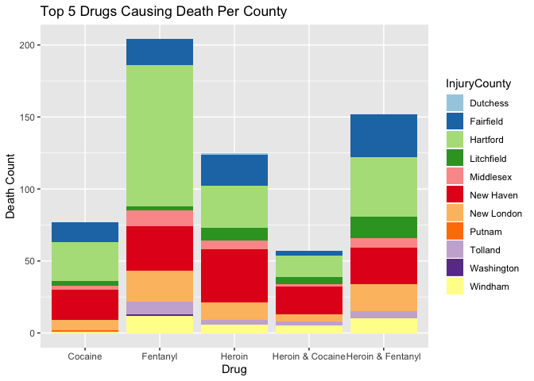<!-- -->

#### Spatial Data Analysis

Because we will be creating a map, we need add a couple of libraries.


```r
library(leaflet)
library(sf)
```

```
## Linking to GEOS 3.7.2, GDAL 2.4.2, PROJ 5.2.0
```

```r
library(widgetframe)
```

```
## Loading required package: htmlwidgets
```

```r
library(here)
```

```
## here() starts at /Users/aleahgoldstein/Documents/R Projects/EDA_AccidentalDrugDeaths_Connecticut
```

Now, let's create a function *GeoSeparate* that separates out the latitude and longitude from the columns *DeathCityGeo*, *ResidenceCityGeo*, and *InjuryCityGeo*.

```r
geoSeparate <- function(Dataset, GeoCol) 
  Dataset %>% 
    separate({{GeoCol}}, into = c("Section1", "Section2"), sep = "\\(")%>%
    separate(Section1, into = c("Section3", "Section4"), sep = ",")%>%
    separate(Section2, into = c("NewGeoColumn", "Section5"), sep = "\\)")%>%
    separate(NewGeoColumn, into = c("GeoColumnLat", "GeoColumnLon"), sep = ",")%>%
    mutate(GeoColumnLat = as.double(GeoColumnLat))%>%
    mutate(GeoColumnLon = as.double(GeoColumnLon))%>%
    select(-Section3, -Section4, -Section5) #remove sections we don't need
```

Because the new columns are always named *GeoColumnLon* and *GeoColumnLat*, we need to rename them. 

```r
df6 <- df2%>%
  geoSeparate(DeathCityGeo)%>% #separate
    rename_all(recode, GeoColumnLat = "DeathCityLat", GeoColumnLon = "DeathCityLon")%>% #rename
  geoSeparate(ResidenceCityGeo)%>% #separate
    rename_all(recode, GeoColumnLat = "ResidenceLat", GeoColumnLon = "ResidenceLon")%>% #rename
  geoSeparate(InjuryCityGeo)%>% #separate
    rename_all(recode, GeoColumnLat = "InjuryCityLat", GeoColumnLon = "InjuryCityLon")%>% #rename
  select(DeathCityLon, DeathCityLat, ResidenceLon, ResidenceLat, InjuryCityLon, InjuryCityLat)%>% #select columns
  filter(!is.na(DeathCityLon), !is.na(DeathCityLat), !is.na(ResidenceLon), !is.na(ResidenceLat), !is.na(InjuryCityLon), !is.na(InjuryCityLat)) #remove any NA values
```

```
## Warning: Expected 2 pieces. Missing pieces filled with `NA` in 5 rows [1, 13,
## 1109, 2683, 4888].
```

```
## Warning: Expected 2 pieces. Missing pieces filled with `NA` in 173 rows [1, 11,
## 12, 13, 97, 102, 108, 152, 236, 245, 295, 313, 351, 352, 374, 461, 506, 514,
## 534, 552, ...].
```

```
## Warning: Expected 2 pieces. Additional pieces discarded in 6 rows [743, 1482,
## 2121, 3003, 3036, 5105].
```

```
## Warning: Expected 2 pieces. Missing pieces filled with `NA` in 1756 rows [1, 2,
## 5, 6, 7, 8, 9, 10, 11, 12, 13, 14, 16, 17, 18, 21, 23, 28, 29, 30, ...].
```

```r
df6
```

```
## # A tibble: 4,937 x 6
##    DeathCityLon DeathCityLat ResidenceLon ResidenceLat InjuryCityLon
##           <dbl>        <dbl>        <dbl>        <dbl>         <dbl>
##  1        -72.7         41.6        -72.7         41.6         -72.7
##  2        -73.4         41.1        -73.4         41.1         -72.7
##  3        -72.9         41.7        -72.9         41.7         -72.7
##  4        -72.7         41.8        -72.7         41.8         -72.7
##  5        -72.9         41.3        -72.9         41.4         -72.7
##  6        -72.6         41.8        -72.6         41.8         -72.7
##  7        -72.1         41.5        -72.1         41.5         -72.7
##  8        -73.1         41.2        -72.7         41.6         -72.7
##  9        -72.9         41.3        -72.7         41.6         -72.7
## 10        -72.7         41.6        -72.7         41.6         -72.7
## # … with 4,927 more rows, and 1 more variable: InjuryCityLat <dbl>
```
These coordinates could be useful for further map creation.

For now, we will create a map of Connecticut showing the median income for each census tract along with the location of each death.

First, we will use the Tidycensus API to get the geometry of each county in Connecticut as well as the median income from 2014-2018. 

```r
ct <- get_acs(state = "CT", 
              geography = "tract",
              variables = c(medincome = "B19013_001"), 
              geometry = TRUE)
```

```
## Getting data from the 2014-2018 5-year ACS
```

```
## Downloading feature geometry from the Census website.  To cache shapefiles for use in future sessions, set `options(tigris_use_cache = TRUE)`.
```

```
## 
  |                                                                            
  |                                                                      |   0%
  |                                                                            
  |====                                                                  |   5%
  |                                                                            
  |=====                                                                 |   7%
  |                                                                            
  |========                                                              |  12%
  |                                                                            
  |==========                                                            |  14%
  |                                                                            
  |=============                                                         |  19%
  |                                                                            
  |===============                                                       |  21%
  |                                                                            
  |==================                                                    |  26%
  |                                                                            
  |====================                                                  |  29%
  |                                                                            
  |=======================                                               |  33%
  |                                                                            
  |=========================                                             |  36%
  |                                                                            
  |============================                                          |  40%
  |                                                                            
  |==============================                                        |  43%
  |                                                                            
  |=================================                                     |  47%
  |                                                                            
  |===================================                                   |  50%
  |                                                                            
  |======================================                                |  54%
  |                                                                            
  |========================================                              |  57%
  |                                                                            
  |===========================================                           |  61%
  |                                                                            
  |=============================================                         |  64%
  |                                                                            
  |================================================                      |  68%
  |                                                                            
  |=================================================                     |  71%
  |                                                                            
  |=====================================================                 |  75%
  |                                                                            
  |======================================================                |  78%
  |                                                                            
  |==========================================================            |  82%
  |                                                                            
  |===========================================================           |  85%
  |                                                                            
  |===============================================================       |  89%
  |                                                                            
  |================================================================      |  92%
  |                                                                            
  |===================================================================   |  96%
  |                                                                            
  |===================================================================== |  99%
  |                                                                            
  |======================================================================| 100%
```

```r
ct <- ct%>%
  filter(!is.na(estimate))
ct
```

```
## Simple feature collection with 823 features and 5 fields
## geometry type:  MULTIPOLYGON
## dimension:      XY
## bbox:           xmin: -73.72777 ymin: 40.98014 xmax: -71.78699 ymax: 42.05059
## CRS:            4269
## First 10 features:
##          GEOID                                               NAME  variable
## 1  09001010101 Census Tract 101.01, Fairfield County, Connecticut medincome
## 2  09001010102 Census Tract 101.02, Fairfield County, Connecticut medincome
## 3  09001010201 Census Tract 102.01, Fairfield County, Connecticut medincome
## 4  09001010202 Census Tract 102.02, Fairfield County, Connecticut medincome
## 5  09001010300    Census Tract 103, Fairfield County, Connecticut medincome
## 6  09001010400    Census Tract 104, Fairfield County, Connecticut medincome
## 7  09001010500    Census Tract 105, Fairfield County, Connecticut medincome
## 8  09001010600    Census Tract 106, Fairfield County, Connecticut medincome
## 9  09001010700    Census Tract 107, Fairfield County, Connecticut medincome
## 10 09001010800    Census Tract 108, Fairfield County, Connecticut medincome
##    estimate   moe                       geometry
## 1    155375 42972 MULTIPOLYGON (((-73.72777 4...
## 2    250001    NA MULTIPOLYGON (((-73.66985 4...
## 3    246667 65564 MULTIPOLYGON (((-73.65501 4...
## 4    188625 65173 MULTIPOLYGON (((-73.60704 4...
## 5    234625 20523 MULTIPOLYGON (((-73.66336 4...
## 6    113275  4482 MULTIPOLYGON (((-73.67224 4...
## 7     68796 22211 MULTIPOLYGON (((-73.65524 4...
## 8     99922 21867 MULTIPOLYGON (((-73.63267 4...
## 9     64722 25463 MULTIPOLYGON (((-73.62359 4...
## 10   134375 26487 MULTIPOLYGON (((-73.60704 4...
```

We need to switch the CRS to EPSG:4326

```r
ct = st_transform(ct, 4326)
```

Below we build a map of Connecticut with each census tract defined. The median income is displayed per tract and markers show where deaths have occured. Zooming in, it appears that higher income areas have fewer deaths. However, there are many other factors that could be correlated such as population size.

```r
popup <- paste0("Median Income in 2014-2018: ", ct$estimate)
pal <- colorNumeric(
  palette = "RdYlGn",
  domain = ct$estimate
)
ct_map <-
  leaflet() %>%
  addTiles() %>%
  addPolygons(data= ct,
              label = ~as.character(NAME),
              fillColor = ~pal(estimate),
              weight = 1,
              opacity = 1.0,
              fillOpacity = 0.5,
              popup = popup,
              highlightOptions = highlightOptions(color = "white",
                                                  weight = 2,
                                                  bringToFront = TRUE))%>%
  addMarkers(data = df6, lng = ~DeathCityLon, lat = ~DeathCityLat, clusterOptions = markerClusterOptions())%>%
  addLegend(pal = pal, 
            values = ct$estimate, 
            position = "bottomright", 
            title = "Median Income in 2014-2018<br>") %>%
   frameWidget()
ct_map
```

<!--html_preserve--><div id="htmlwidget-40e8a79f5af1e905fec9" style="width:100%;height:480px;" class="widgetframe html-widget"></div>
<script type="application/json" data-for="htmlwidget-40e8a79f5af1e905fec9">{"x":{"url":"main_files/figure-html//widgets/widget_unnamed-chunk-51.html","options":{"xdomain":"*","allowfullscreen":false,"lazyload":false}},"evals":[],"jsHooks":[]}</script><!--/html_preserve-->


